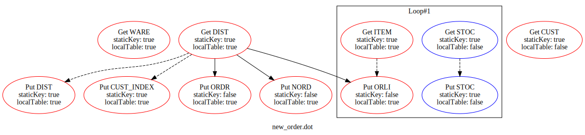

# TPC-C as am Example

The code of TPC-C is shown in [`root/dataflow_api/src/benchmark`](../../dataflow_api/src/benchmark), which contains the defition of TPC-C's [`schema`](../../dataflow_api/src/benchmark/tpcc/tpcc_schema.cc) and five transactions:
*  [`new_order`](../../dataflow_api/src/benchmark/tpcc/txn_new_order.cc)
* [`payment`](../../dataflow_api/src/benchmark/tpcc/txn_payment.cc)
* [`delivery`](../../dataflow_api/src/benchmark/tpcc/txn_delivery.cc)
* [`order_status`](../../dataflow_api/src/benchmark/tpcc/txn_order_status.cc)
* [`stock_level`](../../dataflow_api/src/benchmark/tpcc/txn_stock_level.cc)

## Build

In the `root/dataflow_api` directory, run the following commands. Then the binary `analyze` is compiled.

```bash
mkdir build && cd build
cmake ..
make -j4
```

## Run

After compiling the executable file, we direct run it to generate the output files describing the dataflow graphs.

In the `root/dataflow_api/build` directory, run the following commands. 

```bash
./analyze
```

Then, five `dot` files are generated, one for each type of transaction in TPC-C.

```bash
new_order.dot
payment.dot
delivery.dot
order_status.dot
stock_level.dot
```

## Plot the Dataflow Graph

To visualize the dataflow graph, we use the `graphviz` tool.

First, install `graphviz` with 

```bash
sudo apt install graphviz
```

Then, in the `root/dataflow_api/build` directory where output files are generated, run the following commands to generate `svg` files.

```bash
../plot.sh
```

The resulted graphes are generated in the same directories and shown as following.
### How to Read the Dataflow Graph

The dataflow graphs shown below contains two kinds of nodes: `Get` and `Put`, corresponding to the data flow operations. The `red` frame means whether the operation is analyzed to be exeuted at the prefered partition (specified by `setPartitionAffinity`). Otherwise, the frame is `blue`. Inside each node, the text contains:
1. `Get` or `Put`: The node's type
2. `Ware`, ... : The name of accessed table
3. `staticKey` : Whether the primary key used is determined statically
4. `localTable` : Whether the table is only accessed by transactions has the same partition affinity.

The directed edges representing the `key` (solid edges), `value` (dashed edges), and `control` (dotted edges) dependencies between operations. 

The black quad represents a scope of operations generated by loops or if-branches.

### Static Analysis for Fast Path Optimizatiion

A transaction qualifies for the fast path optimization if:
1. it contains no user-initiated aborts.
2. it can be divided into multiple pieces, each of which can execute individually on one storage node.
3. each piece's read and write sets remain unchanged before and after repair (re-execution).

For condition 1, we can directly analyze whether `abort` apis are invoked.

For condition 2, we need to ensure transactions can be divided into invidual pieces without dependencies among them. In TPC-C, only `New Order` and `Payment` transactions can access remote data. When checking their dataflow graphs, we can observer that there are no dependencies among the red sub-graph and blue sub-graph. Therefore, all TPC-C transactions satisfy the second condition.

For condition 3, we need to determine whether the read and write sets of target transaction (or piece) do not change before and after repair. First, if the primary key of an operation can be determined statically, then corresponding read and write sets must not change. Unfortunately, not all operations in TPC-C use static primary key. Some operations' primary keys depend on previous `Get` operations' outputs. For example, in `New Order` transaction, the primary key of inserting `Order` table is determined by output of reading `District` table. If such `Get` operations' outputs change during repair, then the read or write sets change.

However, if such `Get` operations' outputs do not change after repair, then the overll read and write sets do not change. 
The opportunity is that, the tables targeted by such `Get` operations can be partitioned well and only be accessed by transactions with the same partiton affinity (The red flame part in the dataflow graph). Taking `District` table as the example again, each of its partition is only accessed by transactions executed on the same database node, which is resiponsible for the same set of partition affinity.
Therefore, no cross database nodes conflicts happen on these tables and the outputs are guaranteed to not change after repair.
Finally, we can determine that, for all TPC-C transactions, their read and write sets do not change before or after repair.

### New Order

### Payment

### Delivery

### Order Status

### Stock Level

